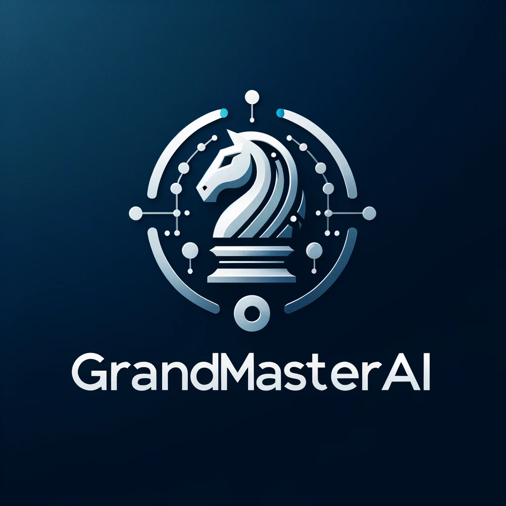

# GrandMasterAI File Structure

This document outlines the file structure for the GrandMasterAI application, detailing where to find various parts of the codebase and their purpose.

## Solution File
- `GrandMasterAI.sln`: The Visual Studio solution file for the project.

## Source Files
- `/src`: Contains all source files for the application.
  - `/GrandMasterAI`: Main project directory.
    - `Program.cs`: The entry point of the application.
    - `GrandMasterAI.cs`: Contains the core logic for the GrandMasterAI application.
    - `ChessDotComClient.cs`: Manages API interactions with Chess.com.
    - `GameProcessor.cs`: Handles game processing logic.
    - `TimerService.cs`: Manages scheduled tasks.
    - `/Properties`: Includes project properties and settings.
      - `AssemblyInfo.cs`: Contains assembly metadata.
    - `/Utils`: Utility classes and helper functions.
      - `Constants.cs`: Application-wide constants.
      - `Helpers.cs`: Helper functions.
  - `/ChessLogic`: Chess game logic components.
    - `ChessPiece.cs`: Base class for all chess pieces.
    - `King.cs`: Specific logic for the King piece.
    - `Queen.cs`: Specific logic for the Queen piece.
    - `Rook.cs`: Specific logic for the Rook piece.
    - `Bishop.cs`: Specific logic for the Bishop piece.
    - `Knight.cs`: Specific logic for the Knight piece.
    - `Pawn.cs`: Specific logic for the Pawn piece.
    - `Board.cs`: Represents the chessboard and manages its state.

## Test Files
- `/tests`: Contains all test files for the application.
  - `/GrandMasterAI.Tests`: Unit tests for the GrandMasterAI project.
    - `GrandMasterAITests.cs`: Unit tests for the core logic.
    - `ChessDotComClientTests.cs`: Tests for the Chess.com API interactions.

## External Libraries
- `/lib`: Third-party libraries not included via NuGet.

## NuGet Packages
- `/packages`: NuGet package dependencies for the project (typically managed by Visual Studio).

## Configuration Files
- `.gitignore`: Specifies files and directories to ignore in version control.
- `README.md`: Comprehensive guide on setting up and using the project.
- `CONTRIBUTING.md`: Guidelines for contributing to the project.
- `LICENSE.md`: The license agreement for using the GrandMasterAI software.

## Additional Resources
- `ACKNOWLEDGMENTS.md`: Credits and acknowledgments for contributions to the project.

