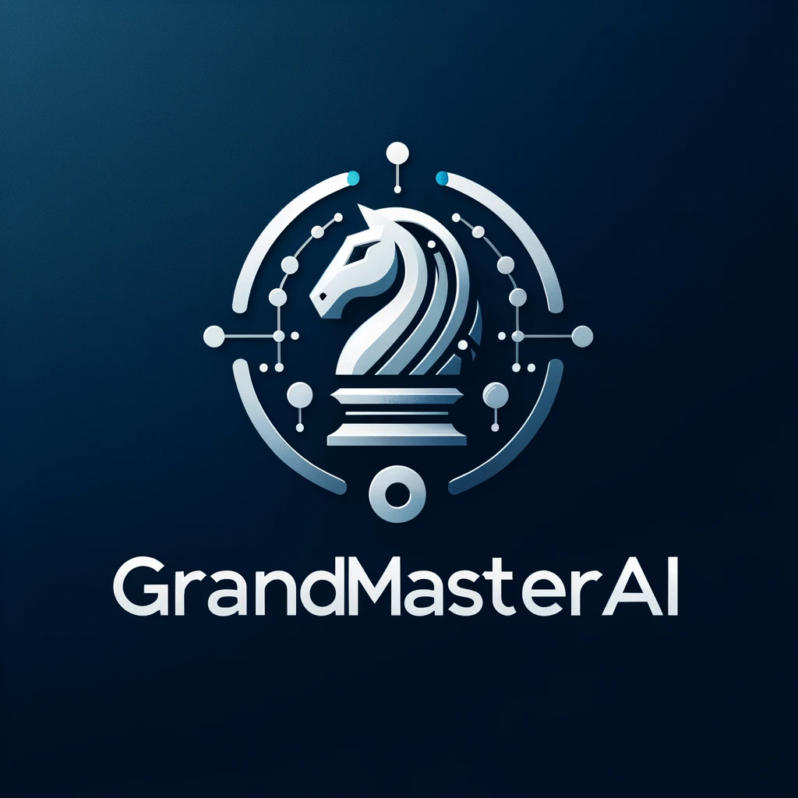

# GrandMasterAI 0.1.1
***"Chess is the Drosophila of artificial intelligence." - Alexander Kronrod***



GrandMasterAI is a minimal sophisticated chess engine that interfaces with Chess Engines or other players to play chess autonomously. It's built to understand and employ advanced chess notations and strategies, making moves independently while adhering to the highest standards of sportsmanship and fair play.

## Features

- **Autonomous Play**: Engages in chess games on Chess.com (For educational purposes) without interaction.
- **Advanced Strategies**: Utilizes complex chess strategies and notations.
- **Sportsmanship**: Maintains ethical conduct and fair play in all interactions.
- **Insightful**: Provides explanations for moves and strategies upon request.

## Getting Started

These instructions will get you a copy of the project up and running on your local machine for development and testing purposes.

### Prerequisites

What things you need to install the software and how to install them:

.NET 6.0 SDK or later
A compatible IDE (e.g., Visual Studio, Visual Studio Code)

### Installing

A step by step series of examples that tell you how to get a development environment running:

Clone the repository:
```
```
Navigate to the project directory:
```
cd GrandMasterAI
```
Restore dependencies:
```
dotnet restore
```
Build the project:
```
dotnet build
```

`DEMO SOON :)`

## Running tests

Automated tests for this system:
```
dotnet test
```
## Built With

C# - The programming language used
.NET - Framework

## Contributing

Please read CONTRIBUTING.md for details on our code of conduct, and the process for submitting pull requests to us.

## Versioning

We use SemVer for versioning. For the versions available, see the tags on this repository.

## Authors

Anthony Hackman - Initial work - GrandMasterAI
Kyle Fadley - Initial logic - GrandMasterAI

See also the list of contributors who participated in this project.

## License

This project is licensed under the MIT License - see the LICENSE.md file for details.

## Acknowledgments


Chess Logic:
@Pharlex: https://github.com/pharlex/Chess

Inspirations:
- Fredrik Knudsen https://www.youtube.com/watch?v=HwF229U2ba8 c.2020
- http://www-formal.stanford.edu/jmc/newborn/newborn.html
- 
